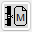
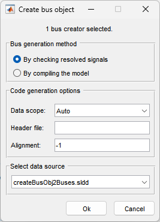
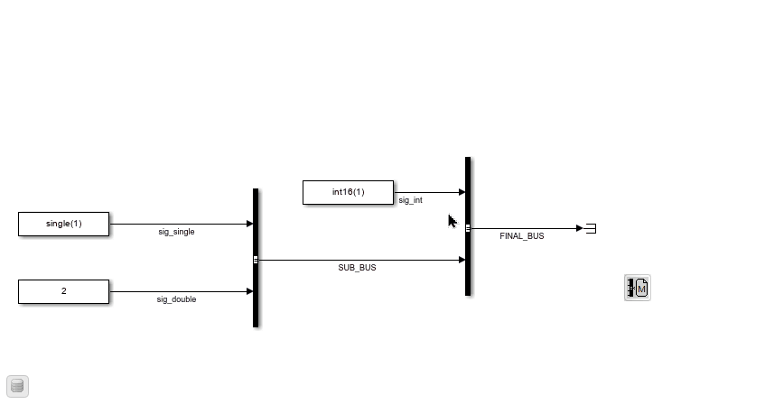
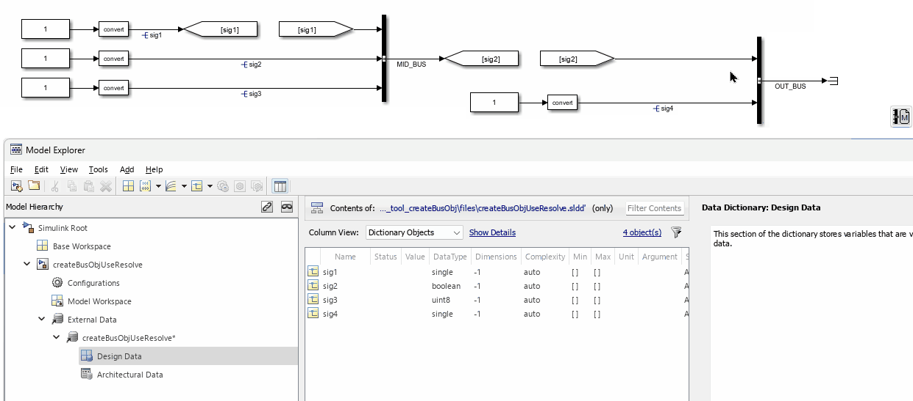
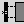
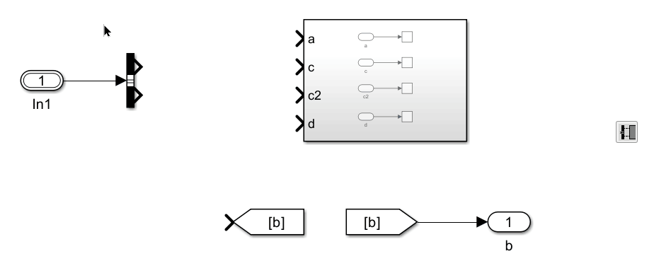

# Bus & Data Dictionaries

## Generate Bus Object for Bus Creators {#create-bus-object}

This function creates bus objects ([Simulink.Bus](https://www.mathworks.com/help/simulink/slref/simulink.bus.html)) for selected Bus Creator blocks. Output lines of the selected Bus Creator blocks must have line names, which will be used as the bus object names.

After clicking the button, a dialog will appear:

### Bus Generation Methods

* **By checking resolved signals:**  
  The software checks the signal name of each input to the Bus Creator block. If all signals are defined, the bus object is created using the defined signal properties. If any signal is not defined, the bus object will not be created.

* **By compiling the model:**  
  The software compiles the model to create bus objects. Reference: [Simulink.Bus.createObject](https://www.mathworks.com/help/simulink/slref/simulink.bus.createobject.html).

### Code Generation Options

Here, you can set various bus object properties.

### Select Data Source

You can choose where to save the newly generated bus objects. If the model is linked to a data dictionary, you can select the main or any referenced data dictionary. If the model has access to the base workspace, you can also select the base workspace.

### Examples

Generate bus objects by compiling the model:

Generate bus objects by checking resolved signals:

## Link Bus Signals {#link-bus-signals}

This function connects a Bus Selector's named bus signals to the matching input ports of one or more selected downstream Subsystem or Model Reference blocks.

**How to use:** Select **one** Bus Selector and one or more Subsystem or Model Reference blocks, then click the button. The tool traces the Bus Selector upstream until it finds a Bus Creator or a resolved Simulink.Bus object, retrieves the bus's element names, and routes each named element line to the same-named input port on every selected downstream block.

**Requirements:**

* Exactly one Bus Selector must be in the selection.
* The Bus Selector's outport must be unconnected.
* The bus must be resolvable upstream — either via a Bus Creator whose inputs are named, or via a `Simulink.Bus` object attached to the bus line.

### Example

## Data Dictionary Functions {#data-dictionary}

This button opens a menu for data dictionary functions. It is available for MATLAB R2016a and later versions.

Currently, it provides two functions:

* Save all data dictionary changes
* Discard all data dictionary changes

These options are only available when there are unsaved changes in any of the open data dictionaries
