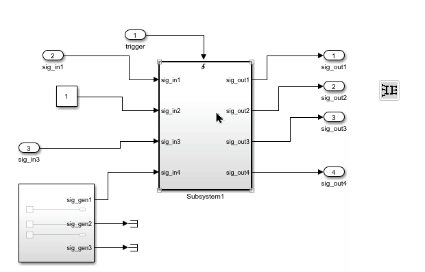
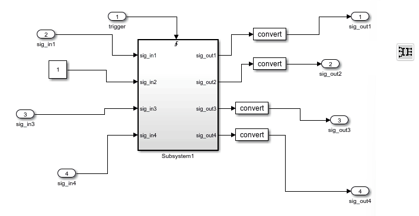
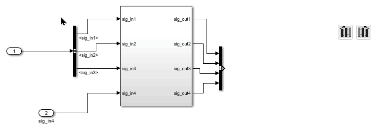
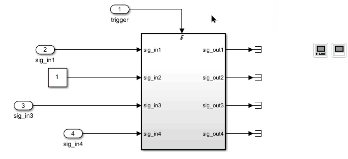

# Tool Panel - General Block Manipulations

The functions in this section apply to all selected blocks.

## Align Connected Blocks {#align-blocks}

  
This function identifies all blocks connected to the selected blocks. For each port, it automatically moves the connected block vertically so that the connecting line becomes straight.

  
You can select multiple blocks, and the alignment will be applied to all of them.

## Adjust Height & Vertical Position for Selected Blocks {#adjust-height}

  
Adjusts the height and vertical position of the selected blocks to match their connected blocks based on output lines.

  
Adjusts the height and vertical position of the selected blocks to match their connected blocks based on input lines.

## Show and Hide Block Names {#show-hide-block-names}

  
Shows the names of the selected blocks.

  
Hides the names of the selected blocks.

