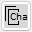
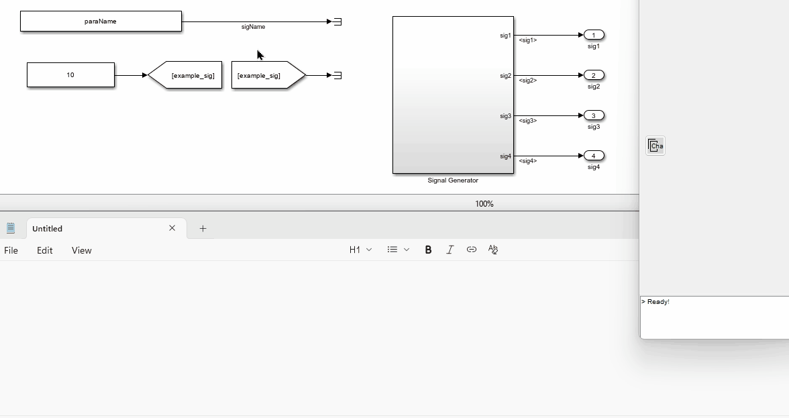
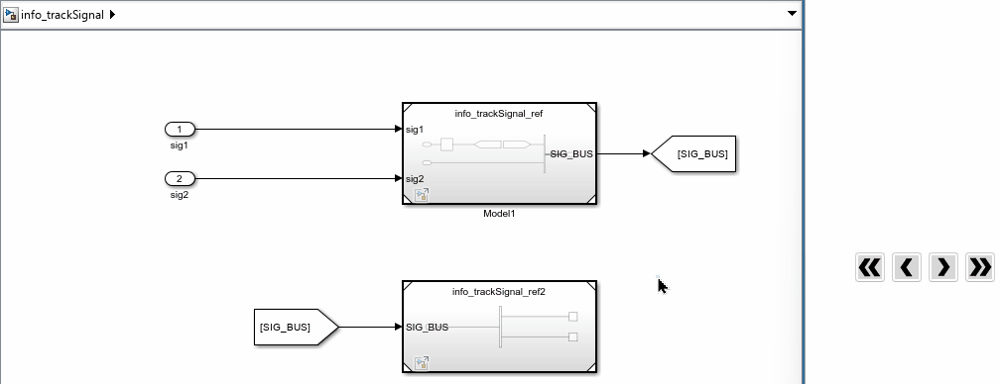
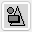
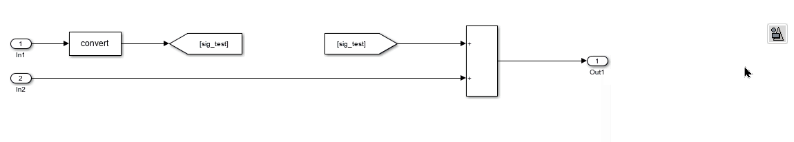

# Tool Panel - Information & Block format

## Copy Characteristic Value {#copy-value}

This button copies the "characteristic value", which is the key property value of a block, to the clipboard. For a line, the "characteristic value" is the signal name. For a block, the "characteristic value" is defined as shown in the table below:

| Block Type           | Mask (For masked SubSystem)                  | Characteristic Property |
|----------------------|----------------------|------------------------|
| Constant             |                      | Value                  |
| DataStoreMemory      |                      | DataStoreName          |
| DataStoreRead        |                      | DataStoreName          |
| DataStoreWrite       |                      | DataStoreName          |
| DataTypeConversion   |                      | OutDataTypeStr         |
| From                 |                      | GotoTag                |
| Gain                 |                      | Gain                   |
| Goto                 |                      | GotoTag                |
| InitialCondition     |                      | Value                  |
| Interpolation_n-D    |                      | Table                  |
| Lookup_n-D           |                      | Table                  |
| LookupNDDirect       |                      | Table                  |
| ModelReference       |                      | ModelName              |
| Prelookup            |                      | BreakpointsData        |
| SubSystem            | Compare To Constant  | const                  |
| SubSystem            | Enumerated Constant  | enum                   |
| SubSystem            |                      | BlockParameters        |
| Terminator           |                      |                        |

If the selected block is not defined in this table, the "characteristic value" is the "Name" of the block.

In future releases, the "characteristic value" will be editable by the user. If you hope to add more block types in all future releases, please contact the author.

## Signal Tracking {#track-signal}

{.inline}
{.inline}

These 2 buttons track a selected signal upstream or downstream for one step.

{.inline}
{.inline}

These 2 buttons track a selected signal upstream or downstream to the furthest point.

You can select a line or a block to track the signal. If the block or the connected block of the selected line has one input and one output, the signal tracking will continue to the next block.

## Apply Pre-defined Style {#apply-style}

This button applies pre-defined formats and other properties to the selected blocks. You can define multiple style sets.

### Style Definition

Right-click the button and select "Open style file folder" to access example style files. Each style set is defined by a Simulink model file or a Simulink library file, with the file name serving as the style name.

In the style file, there should be no more than one block for each "type". The "type" is defined as follows:

* For non-Subsystem blocks, the "type" is the block's "BlockType" property.
* For masked Subsystem blocks, the "type" is the block's "Mask" property.

### Style Properties

The following properties defined in the style file will be applied to the selected blocks:

* BackgroundColor
* ForegroundColor
* FontName
* FontSize
* FontWeight
* FontAngle
* DropShadow
* AttributesFormatString
* HideName
* HideAutomaticName (not available in older versions)

The following properties are optional and can be configured by right-clicking the button and selecting the desired options:

* Block Size: If enabled, the block width and height will be set according to the style file.
* Callbacks: If enabled, all callbacks defined in the style file will be applied to the selected blocks.

### Choosing a Style

You can choose a style by right-clicking the button and selecting "Choose style". In addition to the pre-defined styles, you can also select "Simulink default" to restore the default Simulink style. If "Simulink default" is chosen, the following properties will not be applied:

* HideName
* HideAutomaticName
* Block Size

