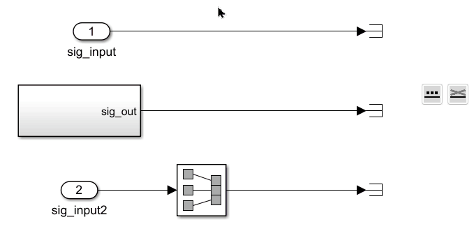
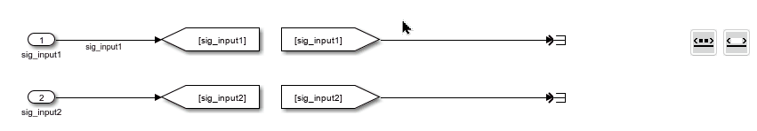
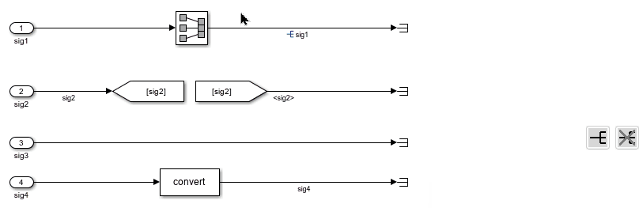
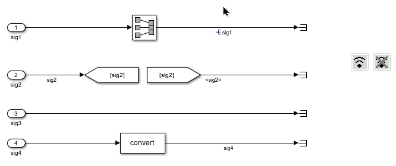

# Tool Panel - Line Manipulations

The functions in this section apply to selected lines.

## Add / Remove Signal Names {#add-remove-names}

This function retrieves the signal names of the selected lines and assigns those names to the lines. If no signal names are found, no changes will be made.

This function removes the signal names from the selected lines.

## Show / Hide Propagated Signal Names {#set-propagate}

This function displays propagated signal names on the selected lines.

This function hides propagated signal names on the selected lines.

## Set / Reset Resolved Signal {#set-resolve}

This function marks the signals on the selected lines as resolved.

This function marks the signals on the selected lines as unresolved.

## Set / Reset Signal Streaming {#set-stream}

This function enables signal streaming for the selected lines.

This function disables signal streaming for the selected lines.

