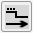
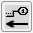
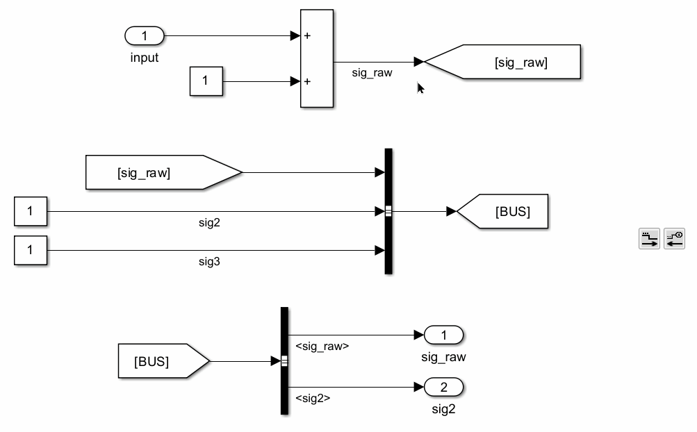
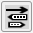
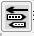
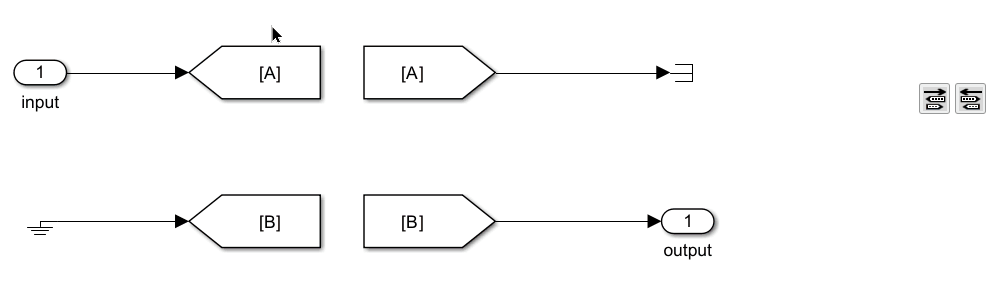
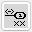
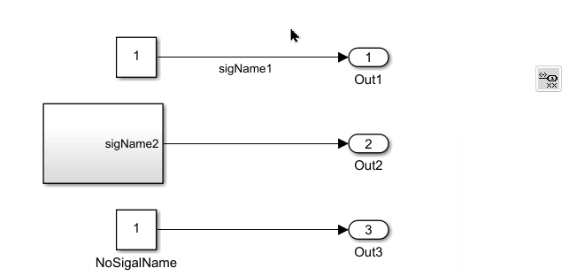
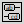
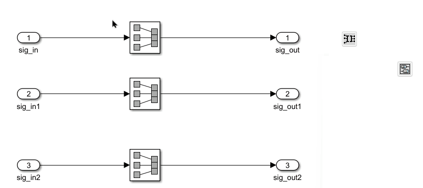

# Tool Panel - Signal Renaming

## Signal Renaming {#signal-renaming}

The buttons in this group push or propagate signal names through the model, keeping signal names consistent between connected blocks.

### Update Signal Names Through Signal Routes

{.inline}
{.inline}

#### Signal Name Obtainment

This function get the signal name of the selected objects, and pushes the signal name downstream or upstream. The following objects are valid for selection in downstream pushing:

- Lines: Signal names are obtained from upstream.
- In/Out blocks: Signal names are obtained from block names.
- Goto/From blocks: Signal names are obtained from GotoTags.

For upstream pushing, only Out blocks are valid for selection, and signal names are obtained from block names.

#### Signal Tracking Logic

This function tracks the signal route until untrackable. It goes through lines, Inport/Outport blocks, Goto/From blocks, and Bus Creators/Selector blocks. The tracking only stops when other blocks are detected. For downstream, when a signal goes into different blocks, all different routes will be tracked.

#### Model Update

It updates the following parameter values if they are inconsistent with the signal name obtained:

- Line names
- Block names of Inport/Outport blocks
- GotoTags of Goto/From blocks
- When tracking downstream, if the signal goes into a bus creator, all bus selectors will be updated if this signal is selected.
- When tracking upstream, if the signal goes into a bus selector, the name of the signal goes into the bus creator will also be updated.
- If a bus object is defined for the bus containing this signal, the bus object will be updated as well.

When the signal goes into other library blocks or model references, and if updates are needed for those files, a warning dialog will pop up and the user can choose files to update.

#### File Selection on Library Blocks and Model References

When the signal goes into other library blocks or model references, and if updates are needed for those files, a warning dialog will pop up and the user can choose files to update. The dialog lists all affected files, and the user can select which files to update.

#### Examples:

Push downstream and push upstream:

### Update GotoTags from Upstream

{.inline}

{.inline}

This function updates Goto block tag names to match the signal name of the connected signal.

### Update In/Out Block Names

This function updates the names of In and Out blocks to match the signal names of the selected blocks.

For In blocks, it traces upstream; for Out blocks, it traces downstream. The function attempts to retrieve signal names from the signal lines. If no signal names are found, it will use the names of other In/Out blocks or the tags of Goto/From blocks.

### Write SubSystem Port Names

This function updates the names of all In/Out blocks within a Subsystem to match the signal names of the selected Subsystems.

