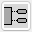
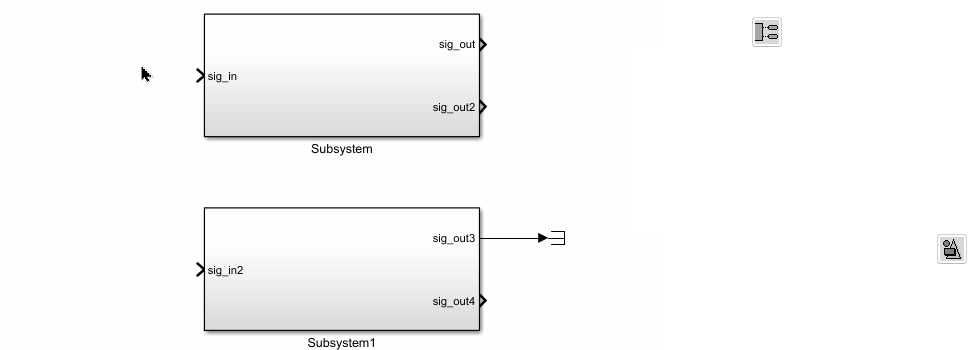
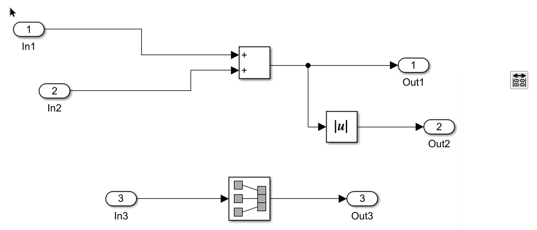
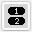
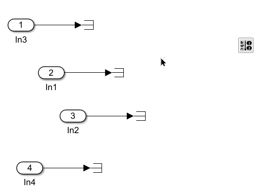
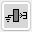
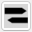
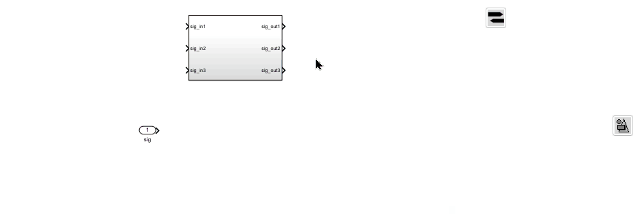
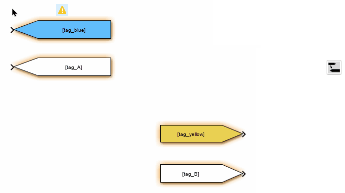

# Tool Panel - Signal Routing Blocks

The functions in this section are related to inports, outports, and in/out blocks.

## Add In/Out Blocks to Empty Ports {#add-in-out-blocks}

This function adds input and output blocks to the empty ports of the selected blocks. The block format will match the style defined in "[Apply Style](info-format.html#apply-style)".

## Align In / Out blocks {#align-in-out-blocks}

This function aligns the selected In/Out blocks to match the position of the ports they are connected to.

## Re-number In/Out blocks by alphabet {#re-number-alpha}

This function renumbers the selected In/Out blocks in alphabetical order of their signal names.

## Add Ground/Terminator to Empty Ports {#add-port-ends}

This function adds a connected Ground block to any empty inport of the selected blocks, or a Terminator block to any empty outport of the selected blocks.

## Add Goto/From to Empty Ports {#create}

This function adds a connected Goto block to any empty inport of the selected blocks, or a From block to any empty outport. The tag name of the Goto/From block is set to the signal name of the port. The block format follows the style selected in the "[Apply Style](info-format.html#apply-style)" function.

## Add Matching From/Goto Blocks {#add-match}

For any selected From or Goto block, this function adds a matching Goto or From block to the model. The new block will use the same format as the selected block and will be placed next to it.

