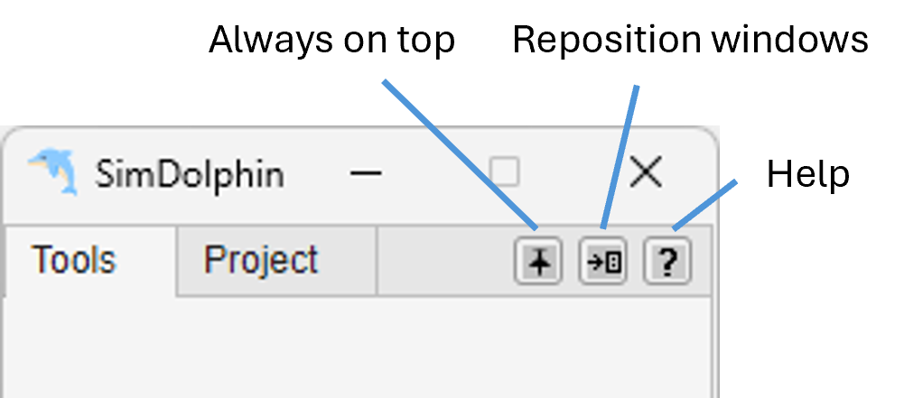
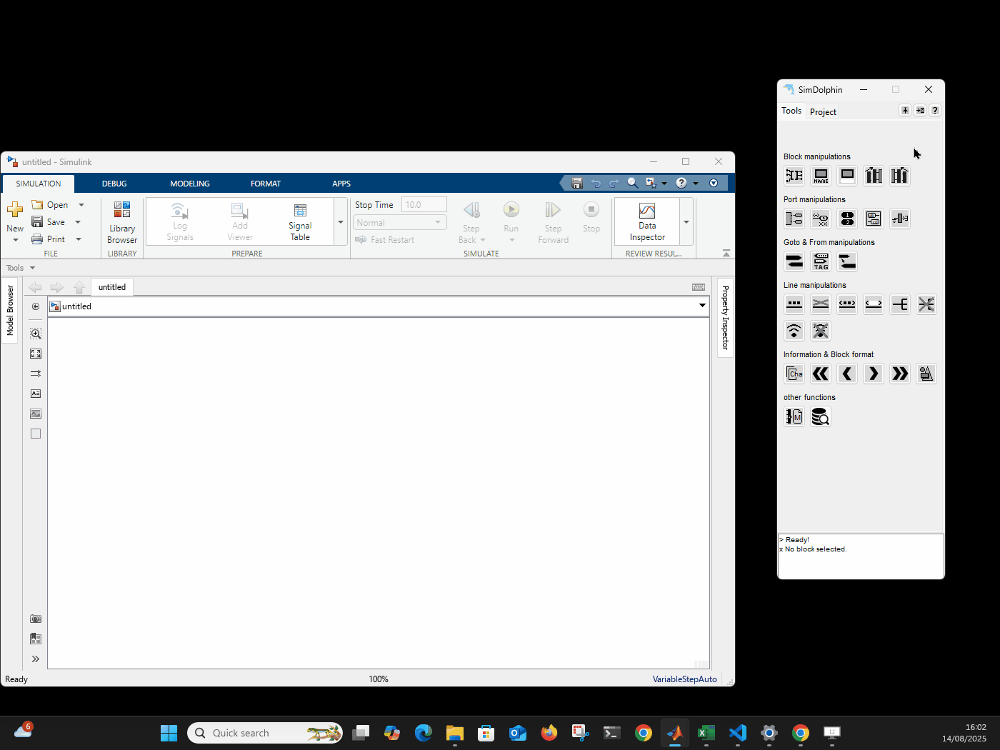

# SimDolphin

**SimDolphin** is a powerful Simulink add-on tool designed to accelerate model-based development. With SimDolphin, you can build models more quickly, navigate complex Simulink projects with ease, and streamline Model-in-the-Loop (MiL) testing. Whether you are developing new systems or maintaining existing models, SimDolphin enhances productivity and simplifies your workflow.

SimDolphin supports MATLAB versions from R2022a to the newest release. If you need support for older versions, please contact us.

## Top Buttons

After launching the software, you will see three top buttons:

{width=288}

- **Always on Top**

This button toggles the "always on top" feature.

{.icon} Always on top off  
{.icon} Always on top on

- **Reposition Windows**

{.icon} This button automatically moves the SimDolphin GUI to the right edge of the current screen and resizes the Simulink canvas to fit the remaining space.

## Tools Panel

This panel provides a comprehensive set of utilities to boost Simulink modeling efficiency. Hover over a button to see a quick description, or right-click to access additional options and help. For more details, see the **[Tool Panel](tool-panel.html)** section.

## Project Panel 

In this panel, you can scan a Simulink model, typically a model-in-the-loop (MiL) model. The scanned data is stored locally, allowing quick access to all signals and parameters within the model. You can also run simulations and check signal values more conveniently. Once unit models are configured, a single simulation provides access to all signal data through fully automated unit model simulations (**one simulation run, all signal data available**), making analysis and debugging significantly faster. For more details, see the **[Project Panel](project-panel.html)** section.

## License and Supported MATlAB Versions

The current demo version is free for MATLAB R2022a and later. Each time you launch the software, an internet connection is required to check the current time. SimDolphin does not collect any user data.

For MATLAB versions before R2022a, a temporary version can be provided upon request for companies. The earliest supported MATLAB version is R2015b.

Updates will be released about once a month. You can subscribe to the [SimDolphin newsletter](https://preview.mailerlite.io/forms/1745232/163191671293478059/share) to get updates, and you can unsubscribe at any time.

## Customisation

If you need functions tailored to meet the needs of your project and enhance your development toolchain, a customisation service is available. Please contact at hello@kinzed.com to discuss your requirements.

## Open Source Code

The following open source code is used in SimDolphin:

- [INI Config](https://www.mathworks.com/matlabcentral/fileexchange/24992-ini-config) by Evgeny Pr