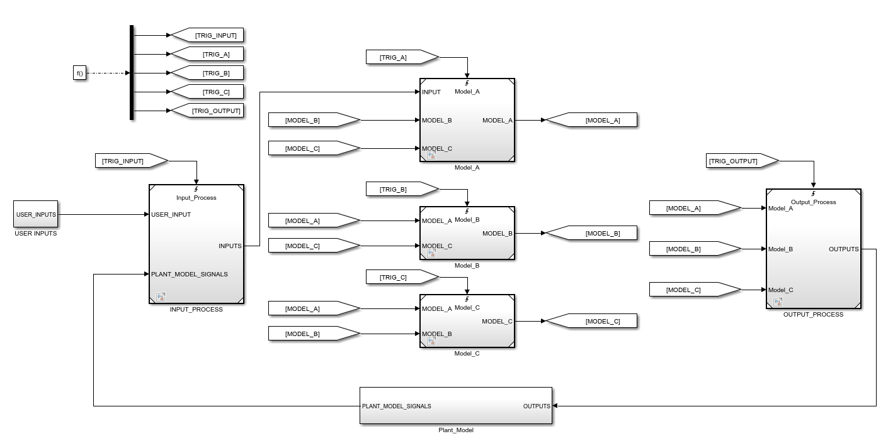
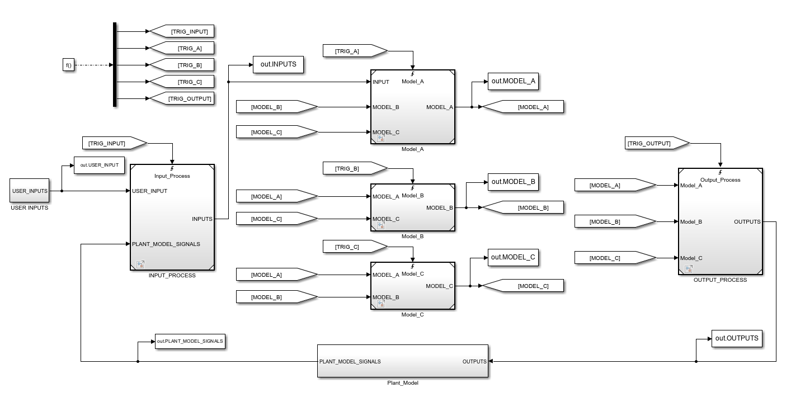
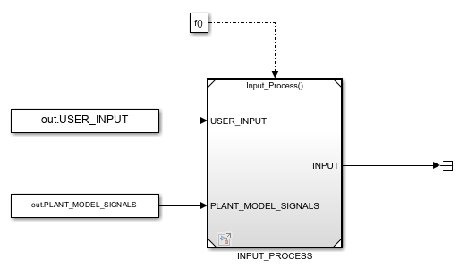
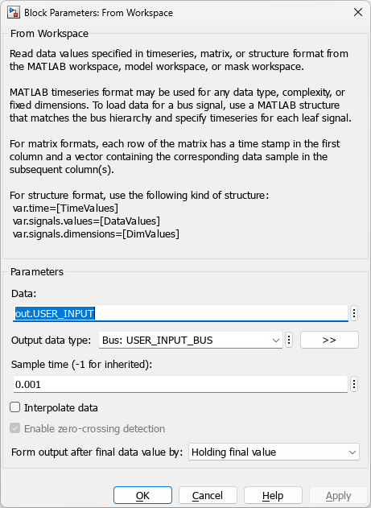
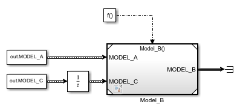

# Project Panel - Simulation in Unit Mode

Running a single MiL simulation can often take a long time, especially for large models. This is usually due to the plant model, particularly if SimScape is used. If parts of your model are configured as unit models, with inputs logged from a full MiL simulation, you can run a unit simulation to quickly access signal values inside the unit models. SimDolphin can fully automate this process once the unit models are configured, allowing you to **run one simulation to obtain all signal values** by running unit simulations automatically. A unit simulation can often be ten times faster than a full MiL simulation.

In **Unit Mode**, double-clicking a signal name in the signal listbox adds it to the "Signals to check" listbox. Clicking "View simulation data" will display the signal values in a Simulation Data Inspector window. If the signals are not yet logged, SimDolphin will run unit simulations automatically before displaying the results.

## Create Unit Models

Currently, SimDolphin only supports unit models created from Model Reference blocks. Support for library blocks will be added in the future.

A typical MiL model looks like this:

This model contains five basic sub-models: INPUT_PROCESS, Model_A, Model_B, Model_C, and OUTPUT_PROCESS. You can create five unit models for them. To generate inputs for each unit model, all input signals must be logged using To-Workspace blocks. If a logged signal is a bus, a bus object must be created for it.

The unit model for INPUT_PROCESS can be created as follows:

From-Workspace blocks are used to provide inputs to the unit model. If an input signal is a bus, the bus object must be specified in the From-Workspace block.

From-Workspace blocks should be configured as follows:

- The output data type must be specified.
- The sample time should be set to match the logged data.

When creating unit models, the [execution sequence](https://www.mathworks.com/help/simulink/ug/controlling-and-displaying-the-sorted-order.html) in the original MiL model must be considered. If an input signal is executed after the current referenced model, a unit delay block must be added to the From-Workspace block.

## Scan Unit Models

All unit models must be saved in a single folder. Click the unit button to select the folder containing all unit models. SimDolphin will scan all unit models and save the information in the project data. After scanning, SimDolphin will automatically switch to **Unit Mode**. In this mode, you can view the value of any signal by running unit simulations automatically.
